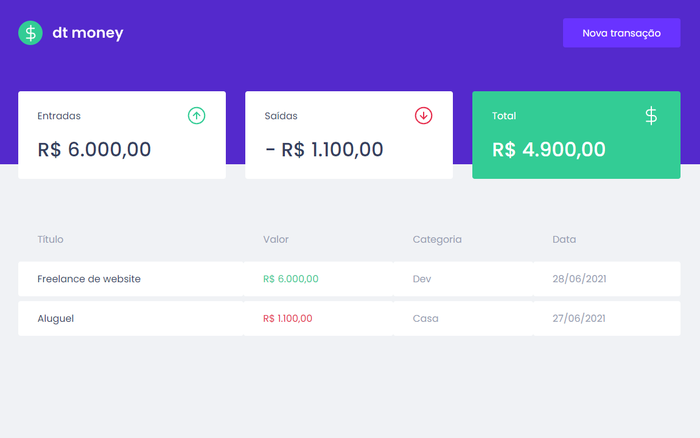
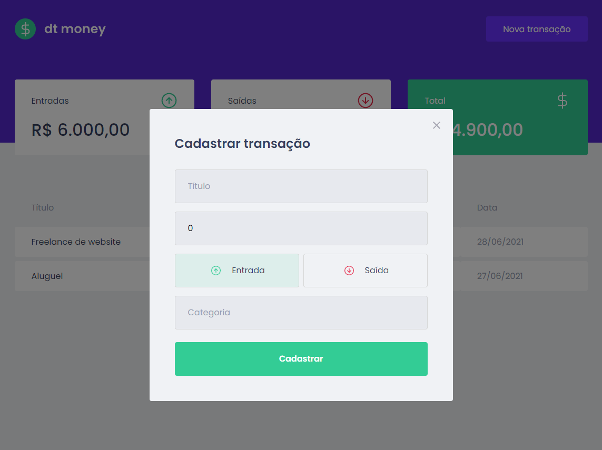

<h1 align="center">
  <br/>
  
  <br/><br/>
  <div>
    
    
    
    
  </div>
</h1>

## ✨ Description

This app is an expenses manager developed during the "Ignite - ReactJS" bootcamp by [@Rocketseat](https://www.rocketseat.com.br).

## 🚀 Technologies
-  React
    -  States, props, contexts
    -  React modal
    -  Custom hooks
-  TypeScript
-  Styled-Components
-  Axios
-  Mirage JS


## 💻 Installation

After cloning/downloading this repository, open your terminal, navigate to the project's folder and run:

```cl
  npm install
  npm run start
```

## 🌟 Preview



